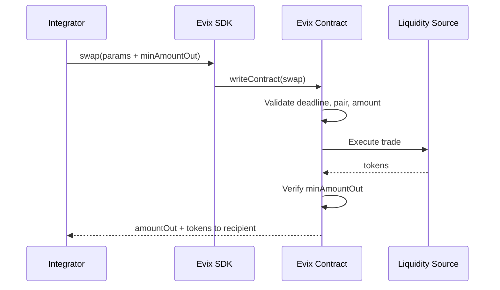

<div className="hero-section">


A customizable execution layer for on-chain trading - built by [Inductiv](https://inductiv.io) for participants that care about execution quality, low latency, and reduced order flow exposure.

<div className="cta-group">
  <a className="cta-primary" href="/getting-started/quickstart">Get Started</a>
  <a className="cta-secondary" href="/api/contract">API Reference</a>
</div>

</div>

---

## Why Evix

Most on-chain execution infrastructure was built for retail flow. Participants with serious execution requirements - HFT desks, institutional traders, latency-sensitive bots - have historically had two options: accept the limitations of public aggregators, or build and maintain their own routing infrastructure.

Neither is satisfactory.

### The Problem with Public Aggregators

Public aggregators introduce three structural problems for sophisticated participants:

**Order flow exposure** - Your trade intentions are visible to third-party infrastructure before execution. For participants whose edge depends on execution privacy, this is not a latency problem. It is a trust problem. Aggregator infrastructure can act on your flow before you do.

**Latency** - Routes are computed off-chain, quotes are generated before the transaction lands, and shared infrastructure means shared congestion. By the time your transaction settles, the path you were quoted may no longer be the best available.

**Execution quality** - Public aggregators optimize for the average case. They route across a limited set of pools relative to what is available on-chain, because full aggregation is expensive and slow in a generalized system. Participants with large or frequent order flow leave measurable value on the table.

### What Evix Provides

Evix gives sophisticated participants access to institutional-grade execution without the overhead of maintaining proprietary infrastructure:

- **Full aggregation** - routing optimized for your specific pairs and flow profile, not a generalized approximation
- **Zero order flow exposure** - your flow never touches third-party infrastructure
- **No latency penalty** - execution happens on-chain with no off-chain dependencies in the execution path
- **Net value optimization** - every deployment is configured to maximize what you actually receive, accounting for both execution quality and transaction costs

---

## Key Properties

<div className="feature-grid">
<div className="feature-card">

### Dedicated Deployments

Each customer receives an isolated Evix deployment per chain. No shared routers, no cross-customer exposure. Your execution environment is yours alone.

</div>
<div className="feature-card">

### Minimal Interface

A single `swap()` function with six parameters. No routing complexity, no off-chain dependencies. Integrate in minutes, not weeks.

</div>
<div className="feature-card">

### Execution-First Design

Execution happens on-chain with built-in deadline enforcement, slippage protection, and pair-level access control - all verified at the contract level.

</div>
<div className="feature-card">

### Execution Intelligence

Each Evix deployment is configured around a customer-specific profile derived from ML analysis of their trading behavior. Routing strategy, quoter parameters, and aggregation behavior are all optimized to maximize net value retained per swap - not applied generically across customers.

[Learn more →](/execution-intelligence)

</div>
<div className="feature-card">

### Multi-SDK Support

First-class SDKs for TypeScript (viem) and Rust (alloy). Build and execute swaps from any environment.

</div>
</div>

---

## How It Works



---

## Who Is Evix For

| Audience | Use Case |
|----------|----------|
| **Execution-sensitive traders** | HFT participants needing deterministic, low-latency execution |
| **Privacy-conscious platforms** | Teams that don't want to expose order flow to third-party aggregators |
| **MEV-aware integrators** | Protocols seeking tighter execution control and reduced MEV leakage |
| **Custom infrastructure teams** | Organizations needing deployment isolation and chain-specific tuning |

---

## Quick Example

```typescript
import { EvixClient } from "./sdk";

const evix = new EvixClient({
  chainId: 8453,
  contractAddress: "0x...",
  publicClient,
  walletClient,
});

// Execute swap - integrator provides their own minAmountOut
const result = await evix.swap({
  tokenIn: USDC,
  tokenOut: WETH,
  amountIn: 1_000_000n,
  deadline: BigInt(Math.floor(Date.now() / 1000) + 120),
  minAmountOut: 390_000_000_000_000n, // set by integrator
  recipient: account.address,
});
```

---

<div className="cta-group">
  <a className="cta-primary" href="/getting-started/quickstart">Start Integrating</a>
  <a className="cta-secondary" href="/architecture">Learn the Architecture</a>
</div>
