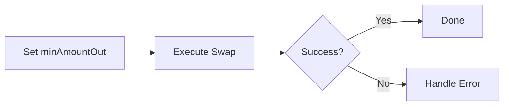

# Integration Overview

Evix supports three integration patterns depending on your environment and requirements.

## Integration Methods

### SDK Integration

Use the TypeScript or Rust SDK to build and execute swaps from your backend or bot. Best for most use cases.

**Best for:** Trading bots, backends, automation

### Direct Contract Call

Call `IEvix.swap()` directly from another smart contract. No SDK needed - just the interface.

**Best for:** On-chain protocols, smart accounts

### Calldata Encoding

Use the SDK to encode swap calldata without executing it. Feed the calldata into your own transaction pipeline.

**Best for:** Custom signers, smart account batching, relay systems

## Comparison

| Capability | SDK Integration | Direct Contract | Calldata Encoding |
|-----------|----------------|----------------|-------------------|
| Simulation (optional) | `simulateSwap()` | `eth_call` | Manual |
| Execution | `swap()` | Contract-to-contract | Your pipeline |
| Language | TypeScript, Rust | Solidity | TypeScript, Rust |
| Wallet required | Yes (for execution) | N/A (contract) | No |
| Complexity | Low | Medium | Medium |

## Typical Flow

Regardless of the integration method, the recommended execution flow is:

1. **Set `minAmountOut`** - The integrator determines the acceptable minimum output from their own pricing or oracle data.
2. **Execute** - Submit the swap transaction with a tight deadline and your `minAmountOut`.
3. **Handle errors** - Check for deadline, slippage, or pair-related reverts.

## Guides

- [Basic Swap](/integration/basic-swap) - End-to-end swap execution
- [Bot Integration](/integration/bot-integration) - Process trade signals with slippage control
- [Smart Account](/integration/smart-account) - Calldata encoding for smart account batching
